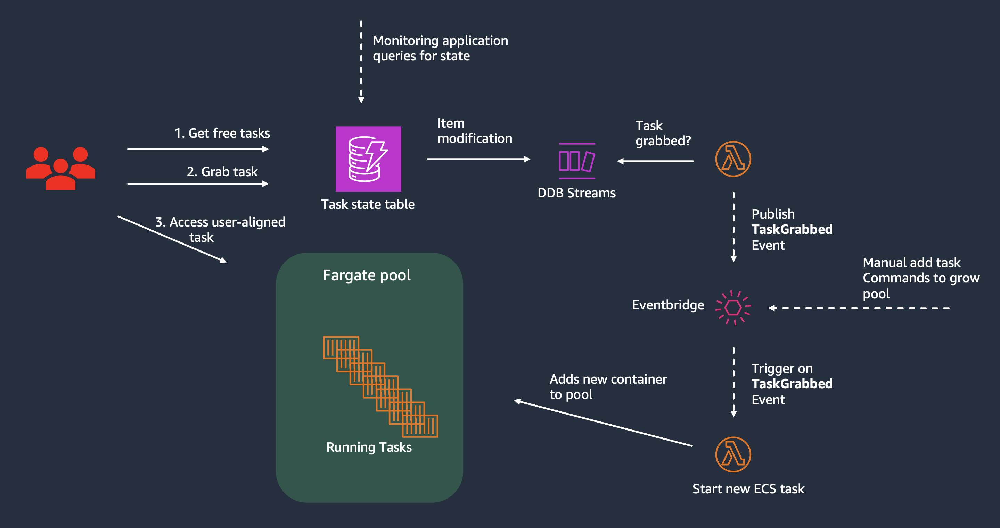

# Fargate pool

Sample setting up a compute pool with ECS Fargate.

The pool sets up x number of "warm" tasks, pre-launched and ready for assingment. When a task is "grabbed" and occupied by a user, an async process receives that event and starts a new task and adds it the warm pool, ensuring x warm tasks. One task = one single container.

A simple UI can optionally be run locally to monitor number of available, launching and assigning tasks to users.

### Prerequisites

- [AWS CLI](https://docs.aws.amazon.com/cli/latest/userguide/getting-started-install.html) installed
- [AWS SAM](https://docs.aws.amazon.com/serverless-application-model/latest/developerguide/install-sam-cli.html) installed
- [OIDC](https://docs.github.com/en/actions/security-for-github-actions/security-hardening-your-deployments/configuring-openid-connect-in-amazon-web-services) set up between your AWS acccount and Github (grants github access to assume a role in your account)

### Overview



The sample uses Github and Github actions to

1. Build and deploy the underlying infrastructure in `infra/` with cloudformation and
2. Build and push the base container in `app/` to ECR

The above sets up the entire infrastructure, to automatically add new tasks (the container specified in `app/`) to the shared compute pool when one is allocated from the pool, to a user.

- `frontend/` contains a local API and frontend, only to demonstrate creating a base pool, visualising the distribution of containers in the pool (available/launching/occupied), and a "grab container from the pool and allocate to a user" button.

- `makefile` contains several targets to make working with the AWS SAM CLI simpler and harmonize local and CI usage of the commands for building and deployment, using environment variables. Run `make` to see available commands, or inspect the makefile for a better overview.

- `scripts/` contains helper methods for manipulating GHA environment variables, and scripts used by some make targets to add or drain tasks from the environment.

#### Simulate traffic

The infra template also sets up 2 lambda functions, triggered every minute, that simulates "grabbing" and "killing" tasks. There's also an ECS "monitoring service", which only queries the pool state and persists metrics in Cloudwatch Metrics. These are for demo purposes and can safely be deleted.

### Usage

1. Change the role you've cofigured Github to have access to in the `.github/workflows` files in the top of both files. This role will be assumed by the Github worker to perform actions in your AWS environment (push a container or deploy cloudformation)

2. Check in repo.

> [!NOTE]  
> During the first deployment there's a chance the output variables from the cloudformation stack aren't available. That means that ECR repository etc can't be resolved when pushing the container. This may occur during the first deployment.

3. Start local API and UI to monitor pool

Build container for local API and starts it, and install the depencies for a react based frontend and runs a dev server.

```bash
make start-local
```

Stopping all local APIs:

```bash
make stop-local
```

4. Add tasks to the pol.

To add a baseline number of tasks, run

```bash
make add-tasks
```

and then choose how many you want in the pool. The solution then keeps the number of warm containers at that number automatically.

5. Use the UI to "grab tasks"

The traffic simulation included in the sample will automatically grab tasks from the pool, and kill "assigned" tasks. You can also use the manual `Grab task` button to mark a container as used by a specific user. This triggers the process to create new tasks and add to the pool.

6. Delete all running tasks

```bash
make drain
```

### Considerations

- With this approach, every task / container gets its own public IP. This is the simplest solution, not requiring any smart routing in the backend to route user requests to their respective container, but it comes with additional cost as AWS now charges per public IP.
-
